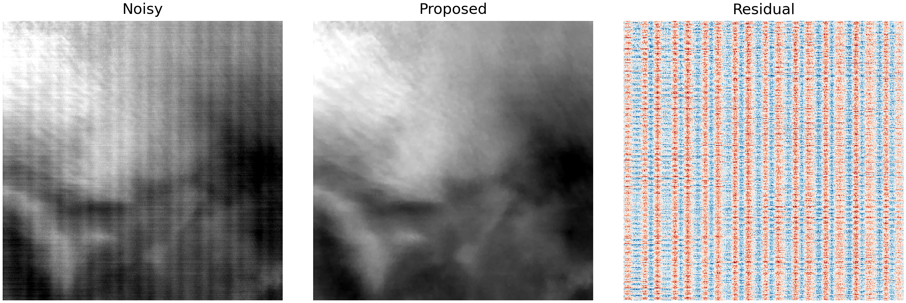
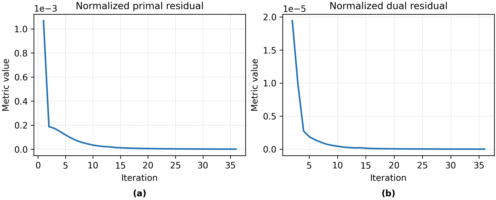
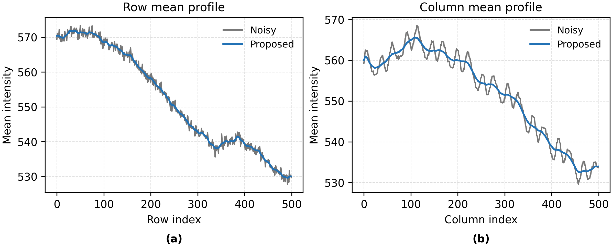

# Minimal MTSNR single-image inference

## Publication Status

This manuscript is currently under review at *IEEE Transactions on Image Processing (TIP)* and has been resubmitted following major revision. This repository will be updated as the work progresses. If you find this method or code useful, please consider citing our work. The complete citation information will be provided once the paper becomes publicly available.
## Code and Data Availability

The current repository provides a minimal inference release containing only the code and example image required to test the proposed method. After the paper is published, we plan to release the complete implementation, experimental data, evaluation scripts, and additional examples needed to reproduce the reported results. All materials will be made publicly available subject to applicable data-sharing policies and third-party licensing requirements.

This small release runs the proposed wavelet-CNN initialization followed by ADMM refinement on one thermal-infrared TIFF. It produces three PDFs containing the image comparison, ADMM convergence, and row/column mean profiles.

The residual shown in the third panel is defined as:

```text
Residual = Noisy - Proposed
```
## Example Results

### Restoration Result

The residual is defined as `Noisy - Proposed`.



[Download the PDF version](Results/noisy_proposed_residual.pdf)

### ADMM Convergence

The normalized primal and dual residuals are plotted using linear axes.



[Download the PDF version](Results/admm_convergence.pdf)

### Row and Column Mean Profiles

The mean profiles compare the noisy input with the proposed restoration result.



[Download the PDF version](Results/row_column_mean_profiles.pdf)

## Contents

- `NoisyImage/`: place exactly one single-band TIFF here;
- `checkpoints/M1_Pad_Mean_best.pth`: released M1 CNN checkpoint;
- `run_single_image.py`: the only program users need to run;
- `src/calibration_restoration/`: required CNN, normalization, ADMM, pipeline, and TIFF I/O modules;
- `Results/`: created automatically and contains the three output PDFs.

The input TIFF must be a finite two-dimensional image in which invalid or defective pixels have already been handled.

## Installation

Python 3.10 or later is recommended.

```bash
python -m pip install -r requirements.txt
```

## Run

From the repository root:

```bash
python run_single_image.py
```

The default program automatically:

1. finds the only TIFF in `NoisyImage`;
2. loads `checkpoints/M1_Pad_Mean_best.pth`;
3. runs the CNN once;
4. runs ADMM with the manuscript parameters;
5. displays the figures and saves:
   - `Results/noisy_proposed_residual.pdf`;
   - `Results/admm_convergence.pdf`;
   - `Results/row_column_mean_profiles.pdf`.

The convergence plots use ordinary linear axes. The mean-profile PDF compares Noisy and Proposed values along both image axes.

To save without opening a display window:

```bash
python run_single_image.py --no-show
```

The device is selected automatically. It can be specified explicitly if needed:

```bash
python run_single_image.py --device cpu
python run_single_image.py --device cuda:0
```

## Adopted ADMM parameters

| Parameter | Value |
|---|---:|
| lambda_1 | 0.11 |
| lambda_2 | 0.90 |
| lambda_3 | 0.035 |
| rho | 0.10 |
| maximum iterations | 50 |
| relative stopping tolerance | 1e-6 |

## Test

```bash
python -m unittest discover -s tests -v
python -m compileall -q run_single_image.py src tests
```

This is an inference-only release. Training, comparison methods, batch processing, and manuscript plotting utilities are not included.
